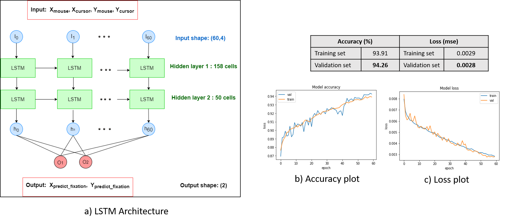
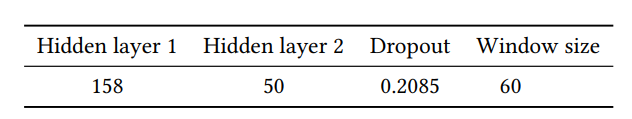
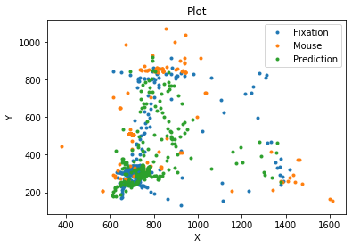
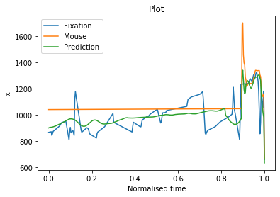

# Spatio-temporal-VisAttention
Fachpraktikum Machine learning and Computer vision laboratory for Human Computer Interaction

## Reference
1. Main paper to be cited ([Xu et al., 2016](https://perceptual.mpi-inf.mpg.de/files/2016/02/xu16_chi.pdf))
2. Python Code for evaluating salience metrics from https://github.com/imatge-upc/saliency-salgan-2017 and https://github.com/tarunsharma1/saliency_metrics

```
@inproceedings{basepaper,
author = {Xu, Pingmei and Sugano, Yusuke and Bulling, Andreas},
year = {2016},
month = {05},
pages = {3299-3310},
title = {Spatio-Temporal Modeling and Prediction of Visual Attention in Graphical User Interfaces},
doi = {10.1145/2858036.2858479}
}

```


## Overview:
  A LSTM model implementation for enhancing spatio-temporal attention modeling from ([Xu et al., 2016](https://perceptual.mpi-inf.mpg.de/files/2016/02/xu16_chi.pdf)) for graphical user interfaces.
  
## Dataset:
  Provided by the department (from [Xu et al., 2016])
  
## LSTM Model Architecture:



Hyperparameter optimization was performed using Bayesian optimization method to obtain the following model parameters:



**Loss: mse**


**Optimizer: RMSprop**


## Repo Usage:
1. Spatio-temporal_LSTM_model.ipynb : Data pre-processing, hyperparameter tuning, final model training and testing. Generated predictions to csv file.

2. LSTM_Spatial_Utility.ipynb and LSTM_Temporal_Utility.ipynb : code for generating images from predictions and obtaining corresponding attention maps.

3. LSTM_Spatial_SaliencyMetrics_Evaluation.ipynb and LSTM_Temporal_SaliencyMetrics_Evaluation.ipynb: Code to evaluate salience metrics 

## Results visualisation:
Static attention prediction



Dynamic attention prediction




  
  


  


